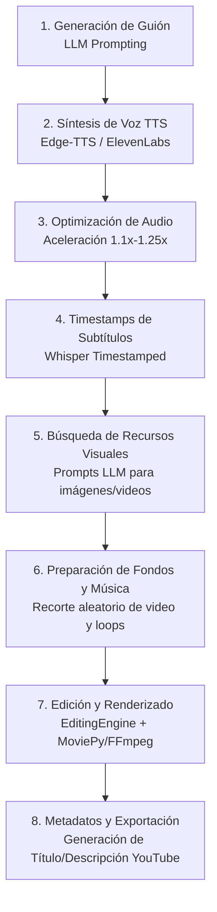

# Estructura, Tecnologías y Pipeline de ShortGPT

Documento descriptivo de la arquitectura, componentes tecnológicos, flujo de construcción paso a paso y catálogo completo de prompts utilizados en el proyecto **ShortGPT**.

---

## 1. 🛠️ Tecnologías Utilizadas

| Categoría | Tecnología / Librería | Propósito en el Proyecto |
| :--- | :--- | :--- |
| **Lenguaje Base** | `Python 3.10+` | Lenguaje de desarrollo principal de todo el framework. |
| **Modelos de Lenguaje (LLM)** | `OpenAI API (GPT-3.5 / GPT-4)`, `tiktoken` | Generación de guiones, extracción de preguntas, filtrado de historias, consultas de imágenes/videos y metadatos SEO. |
| **Síntesis de Voz (TTS)** | `Edge-TTS` (Microsoft), `ElevenLabs API` | Generación automatizada de locución de audio realista y multilingüe. |
| **Reconocimiento y Alineación de Voz** | `whisper-timestamped`, `torch`, `torchaudio` | Transcripción de audio a nivel de palabra con timestamps exactos para subtítulos dinámicos. |
| **Edición y Composición de Video** | `MoviePy 2.x`, `FFmpeg` | Montaje programático de clips, ajuste a formato vertical (9:16 - 1080x1920), recorte, loops de música y renderizado final. |
| **Procesamiento de Imágenes** | `Pillow (PIL)` | Generación dinámica de tarjetas (ej. cabecera con estilo Reddit, avatar, badges de upvotes) y renderizado de texto. |
| **Descarga y Búsqueda de Recursos** | `yt-dlp`, Bing Image Search, Pexels API | Descarga de videos de fondo (gameplay, parkour, fondos relajantes), pistas de música y búsqueda de imágenes/b-rolls contextuales. |
| **Base de Datos y Persistencia** | `TinyDB`, `TinyMongo` | Almacenamiento local ligero para configuración de activos, enlaces de recursos y caché de tareas. |
| **Interfaz de Usuario (GUI)** | `Gradio 4.x` | Panel de control web interactivo para configuración de API keys, generación de videos en tiempo real y logs. |

---

## 2. 🏗️ Arquitectura de Construcción Paso a Paso

El proceso de creación de videos en ShortGPT sigue un flujo estructurado a través de motores (`Engines`) derivados de `AbstractContentEngine` y `ContentShortEngine`:



### Paso 1: Generación del Guión (`_generateScript`)
- Según el tipo de video (`Facts`, `Reddit`, `Custom Video`):
  - **Facts Short**: Se consulta el LLM con una categoría o tema (ej. *"Weird facts"*) y se produce una lista de curiosidades cortas con un hook inicial.
  - **Reddit Short**: Se genera o extrae una pregunta llamativa estilo `r/AskReddit` y se genera una historia o anécdota en primera persona (120–140 palabras).
  - **Video General**: Se escribe un guión conciso adaptado a la descripción del usuario.

### Paso 2: Generación de Voz (`_generateTempAudio`)
- Si el idioma objetivo no es inglés, el guión pasa primero por traducción mediante LLM.
- Se invoca `VoiceModule` (`EdgeTTSVoiceModule` o `ElevenLabsVoiceModule`) para sintetizar el archivo de audio `temp_audio_path.wav`.

### Paso 3: Optimización y Aceleración de Audio (`_speedUpAudio`)
- Para mantener el ritmo dinámico característico de YouTube Shorts/TikTok/Reels, se procesa el audio con `audio_utils.speedUpAudio` (ajuste de tempo mediante filtros de audio/ffmpeg) produciendo `audio_voice.wav`.

### Paso 4: Extracción de Timestamps para Subtítulos (`_timeCaptions`)
- `whisper-timestamped` procesa `audio_voice.wav` devolviendo cada palabra con su intervalo temporal exacto `(start_time, end_time)`.
- `captions.getCaptionsWithTime()` agrupa las palabras en bloques legibles de 1 a 3 palabras para subtitulado dinámico estilo Short.

### Paso 5: Consultas de Recursos Visuales (`_generateImageSearchTerms` / `_generateVideoSearchTerms`)
- Con la lista de subtítulos y marcas de tiempo, se consulta al LLM con un prompt especializado (`editing_generate_images.yaml` o `editing_generate_videos.yaml`).
- El LLM devuelve un JSON estructurado con marcas de tiempo y términos de búsqueda concretos de 1 a 2 palabras para ilustrar cada momento.

### Paso 6: Descarga y Preparación de Fondos y Música (`_prepareBackgroundAssets`)
- Se selecciona un video de fondo del catálogo (`AssetDatabase`, ej. Minecraft Parkour, GTA, Soap Cutting) y una pista de música.
- Se obtiene la duración del audio de voz.
- Se extrae un fragmento aleatorio del video de fondo con la duración exacta requerida (`extract_random_clip_from_video`).

### Paso 7: Composición y Renderizado Automatizado (`_editAndRenderShort`)
- `EditingEngine` construye una lista declarativa de pasos (`EditingStep`):
  1. `ADD_VOICEOVER_AUDIO`: Pista principal de voz.
  2. `ADD_BACKGROUND_MUSIC`: Música atenuada de fondo (volumen ~11%).
  3. `CROP_1920x1080`: Recorte y centrado a resolución vertical 1080x1920.
  4. `ADD_CAPTION_SHORT`: Subtítulos animados superpuestos en el centro/tercio inferior con resaltado y bordes.
  5. `SHOW_IMAGE` / `SHOW_REDDIT_IMAGE`: Superposición de imágenes contextuales o tarjeta de Reddit en la parte superior.
  6. `ADD_SUBSCRIBE_ANIMATION` & `ADD_WATERMARK`: Elementos de retención y marca de agua.
- `EditingEngine.renderVideo()` procesa el pipeline a través de MoviePy y FFmpeg, generando `rendered_video.mp4`.

### Paso 8: Generación de Metadatos y Organización Final (`_addYoutubeMetadata`)
- El LLM genera un título optimizado para el algoritmo (<80 caracteres, máximo 2 emojis) y una descripción (<240 caracteres con hashtags).
- El archivo de video se renombra y se guarda en la carpeta `videos/` junto con un archivo `.txt` con los metadatos.

---

## 3. 📜 Catálogo Completo de Prompts (Prompt Templates)

Todos los prompts del sistema están modularizados en archivos YAML en `shortGPT/prompt_templates/`. A continuación se detalla cada uno:

---

### 3.1 Generador de Hechos y Curiosidades (`facts_generator.yaml`)
- **Ubicación:** `shortGPT/prompt_templates/facts_generator.yaml`
- **Uso:** Genera guiones de curiosidades (<50 segundos de lectura, máx. 140 palabras) con un gancho inicial.

```yaml
system_prompt: >
  You are an expert content writer of a YouTube shorts channel. You specialize in `facts` shorts.
  Your facts shorts are less than 50 seconds verbally ( around 140 words maximum). They are extremely captivating, and original.
  The user will ask you a type of facts short and you will produce it.
  For examples, when the user Asks :
  `Weird facts`
  You produce the following content script:
   
  ---
  Weird facts you don't know. 
  A swarm of 20,000 bees followed a car for two days because their queen was stuck inside.
  Rockados cannot stick their tongue out because it's attached to the roof of their mouths. 

  If you tickle a rat day after day, it will start laughing whenever it sees you. 

  In 2013, police and the Maldives arrested a coconut for lordering near a polling station for the presidential election.
  Locals fear the coconut may have been ingrained with a black magic spell to influence the election. 

  A Chinese farmer who always wanted to own his own plane built a full scale,
  non-working replica of an airbus A320 out of 50 tons of steel. It took him and his friends over two years and costed over $400,000. 

  When invited by a lady to spend a night with her, Benjamin Franklin asked to postpone until winter when nights were longer.
  ---
   
  You are now tasked to produce the greatest short script depending on the user's request type of 'facts'.
  Only give the first `hook`, like "Weird facts you don't know. " in the example. Then the facts.
  Keep it short, extremely interesting and original.

chat_prompt: >
  <<FACTS_TYPE>>
```

---

### 3.2 Generación de Temas de Hechos (`facts_subjects_generation.yaml`)
- **Ubicación:** `shortGPT/prompt_templates/facts_subjects_generation.yaml`
- **Uso:** Produce una lista aleatoria de temáticas de curiosidades en formato JSON.

```yaml
system_prompt: >

chat_prompt: >
  For a series of <<N>> youtube video about top 10 facts on a certain subject,
  pick a random subject. Be very original. Put it in the '`Subject` facts' format.
  Give the output in an array format that's json parseable., like ['Police facts', 'prison facts'].
  Only give the array and nothing else.
```

---

### 3.3 Generación de Preguntas de Reddit (`reddit_generate_question.yaml`)
- **Ubicación:** `shortGPT/prompt_templates/reddit_generate_question.yaml`
- **Uso:** Crea una pregunta abierta y llamativa tipo r/AskReddit dirigida al lector (<80 caracteres).

```yaml
system_prompt: |
  You will write an interesting reddit ask thread question.

  Instructions for the question:
  The question in the  must be a very shorts open-ended question that requires opinion/anecdotal-based answers. Examples of questions are:
  ---
  What’s the worst part of having a child?
  What screams “this person peaked in high school” to you?
  What was your “it can’t be that easy / it was that easy” moment in your life?
  Have you ever had a bad date turning into a good one?
  ---
  Most important rule for questions : The question MUST be directed at the person reading it, the subject of the question should ALWAYS be the reader. It must contain 'you' or 'your', or something asking THEM their experience.
  * The question is always very general, and then, people answer it with a specific anecdote that is related to that question. The question is always short and can bring spicy answers.
  * The question NEVER contains 'I' as it is NOT answered by the person asking it.
  * The question is NEVER too specific about a certain situation.
  * The question should be as short and consise as possible. NEVER be too wordy, it must be fast and concise.
  * The question must sound good to the ear, and bring interest. It should sound natural.
  * The question must use the vocabulary of reddit users. Young, not too complicated, and very straight to the point.
  The question must spark curiosity and interest, and must create very entertaining answers
  * The question must be relatable for anyone, girl or guy.
  * The question is maximum 80 characters long

chat_prompt: |
  Totally new question:
```

---

### 3.4 Generación de Historia de Reddit (`reddit_generate_script.yaml`)
- **Ubicación:** `shortGPT/prompt_templates/reddit_generate_script.yaml`
- **Uso:** Genera una anécdota en primera persona respondiendo a la pregunta de Reddit (120-140 palabras).

```yaml
system_prompt: |
  Instructions for the new story:
  You are a YouTube shorts content creator who makes extremely good YouTube shorts over answers from AskReddit questions. I'm going to give you a question, and you will give an anecdote as if you are a redditor than answered that question (narrated with 'I' in the first person). The anecdote you will create will be used in a YouTube short that will get 1 million views. 
  1- The story must be between 120 and 140 words MAXIMUM.
  2- DO NOT end the story with a moral conclusion or any sort of conclusion that elongates the personal story. Just stop it when it makes sense.
  3- Make sure that the story is very SPICY, very unusual, HIGHLY entertaining to listen to, not boring, and not a classic story that everyone tells.
  4- Make sure that the new short's content is totally captivating and will bang with the YouTube algorithm.
  5- Make sure that the story directly answers the title.
  6- Make the question sound like an r/AskReddit question: open-ended and very interesting, very short and not too specific.
  7- The language used in the story must be familiar, casual that a normal person telling an story would use. Even youthful.
  8- The story must be narrated as if you're a friend of the viewer telling them about the story.
  9- Start the the story with 'I'

chat_prompt: |
  Reddit question: <<QUESTION>>

  -New Generated story. The story has to be highly unusual and spicy and must really surprise its listeners and hook them up to the story. Don't forget to make it between 120 and 140 words:
  Reddit, <<QUESTION>>
```

---

### 3.5 Extracción de Pregunta desde Transcripción de Reddit (`reddit_extract_question.yaml`)
- **Ubicación:** `shortGPT/prompt_templates/reddit_extract_question.yaml`
- **Uso:** Deduce la pregunta original de r/AskReddit a partir de una historia ya escrita.

```yaml
system_prompt: |
  From the transcript of a reddit ask, tell me the question in the title. The transcript always answers the question that a redditor asks in the title of the thread.
  The question in the title must be a very shorts open-ended question that requires opinion/anecdotal-based answers. Examples of questions are:
  ---
  What’s the worst part of having a child?
  What screams “this person peaked in high school” to you?
  What was your “it can’t be that easy / it was that easy” moment in your life?
  ---
  Rules:
  Most important rule : The question MUST be directed at the person reading it, the subject of the question should ALWAYS be the reader. It must contain 'you' or 'your', or something asking THEM their experience.
  * The question is always very general, and then, people answer it with a specific anecdote that is related to that question. The question is always short and can bring spicy answers. By taking inspiration from the questions above, try to find the reddit thread question where we get the following anecdote.
  * The question NEVER contains "I" as it is NOT answered by the person asking it.
  * The question is NEVER specific too specific about a certain situation.
  * The question should be as short and consise as possible. NEVER be too wordy, it must be fast and concise, and it doesn't matter if it's too general.
  * The question must sound good to the ear, and bring interest. It should sound natural.
  * The question must use the vocabulary of reddit users. Young, not too complicated, and very straight to the point.
  * The question must be relatable for anyone, girl or guy.
  The question should ALWAYS START with "What"
chat_prompt: |
  -Transcript:
  <<STORY>>
  The question should ALWAYS START with "What"
  -Most probable very short and conssise open-ended question from the transcript (50 characters MAXIMUM):
```

---

### 3.6 Filtros de Calidad y Realismo para Historias (`reddit_story_filter.yaml` y `reddit_filter_realistic.yaml`)
- **Ubicación:** `shortGPT/prompt_templates/reddit_story_filter.yaml`
- **Uso:** Califica la plausibilidad de una historia de 0 a 10 para descartar alucinaciones absurdas.

```yaml
system_prompt: >
  You're a judge of the realisticness of a story for a youtube short. 
  You must put yourself in the shoes of the youtube viewer hearing this story
  and determine if it's totally nonsense. 
  Your goal will be to judge if it can possibly happen. 
  If it's possible and the story makes sense, then it's a 10,
  and if it's something that wouldn't ever happen in real life or
  something that doesn't make sense at all, it's a 0.
   
  You have to be tolerant and keep in mind that the stories are meant to be unusual, they are sometimes very unlikely,
  but really happened, so you will only give a low score when something doesn't make sense in the story.
  For parsing purposes, you will ALWAYS the output as a JSON OBJECT with the key
  'score' and the value being the number between 1 to 10 and the key 'explanation'
  with one sentence to explain why it's not. Make this explanation maximum 4 words.
  The output should look like:
  {"score": 4.5, "explanation": "some words..."}
   
  Give perfect json with keys score and explanation, and nothing else.

chat_prompt: >
  Story:
   
  <<INPUT>>
   
  Output:
```

---

### 3.7 Generador de Nombres de Usuario de Reddit (`reddit_username.yaml`)
- **Ubicación:** `shortGPT/prompt_templates/reddit_username.yaml`
- **Uso:** Crea nombres de usuario ficticios creíbles para las tarjetas de Reddit.

```yaml
system_prompt: >
  
chat_prompt: >
  Generate a random Reddit name with one or two numbers inside the name. Only generate one name, and don't output anything else. Make it sound natural. The name must be between 7 and 10 characters:
  u/
```

---

### 3.8 Búsqueda Temporal de Imágenes para Edición (`editing_generate_images.yaml`)
- **Ubicación:** `shortGPT/prompt_templates/editing_generate_images.yaml`
- **Uso:** Asocia términos de búsqueda de imágenes concretas a marcas de tiempo de los subtítulos.

```yaml
system_prompt: |
  You are an AI specialized in generating precise image search queries for video editing. You must output ONLY valid JSON in the specified format, with no additional text.

chat_prompt: |
  You are a shorts video editor. Your audience is people from 18 yo to 40yo. Your style of editing is pretty simple, you take the transcript of your short and put a very simple google image to illustrate the narrated sentences.

  Each google image is searched with a short query of two words maximum. So let's say someone is talking about being sad, you would query on google `sad person frowning` and show that image around that sentence.

  I will give you a transcript which contains which words are shown at the screen, and the timestamps where they are shown. Understand the transcript, and time images at timestamps and, write me the query for each image. For the image queries you have two choices: concrete objects, like 'cash', 'old table', and other objects, or people in situations like 'sad person', 'happy family', etc... Generate a maximum of <<NUMBER>> image queries equally distributed in the video.

  Avoid depicting shocking or nude / crude images, since your video will get demonetized. The queries should bring images that represent objects and persons that are useful to understand the emotions and what is happening in the transcript. The queries should describe OBJECTS or PERSONS. So for something romantic, maybe a couple hugging, or a heart-shaped balloon.

  The images should be an image representation of what is happening. Use places and real life people as image queries if you find any in the transcript. Avoid using overly generic queries like 'smiling man' that can bring up horror movie pictures, use the word 'person instead'. Instead, try to use more specific words that describe the action or emotion in the scene.

  IMPORTANT OUTPUT RULES:
  1. NEVER use abstract nouns in the queries
  2. ALWAYS use real objects or persons in the queries
  3. Choose more objects than people
  4. Generate exactly <<NUMBER>> queries
  5. Output must be valid JSON in this format:
  {
    "image_queries": [
      {"timestamp": 1.0, "query": "happy person"},
      {"timestamp": 3.2, "query": "red car"}
    ]
  }

  Transcript:
  <<CAPTIONS TIMED>>

  Generate exactly <<NUMBER>> evenly distributed image queries based on the transcript above. Output ONLY the JSON response, no additional text.
```

---

### 3.9 Búsqueda Temporal de Videos B-Roll (`editing_generate_videos.yaml`)
- **Ubicación:** `shortGPT/prompt_templates/editing_generate_videos.yaml`
- **Uso:** Segmenta el video en bloques de 4 a 5 segundos con 3 términos de búsqueda para encontrar clips de fondo.

```yaml
system_prompt: |
  You are an AI specialized in generating precise video search queries for video editing. You must output ONLY valid JSON in the specified format, with no additional text.

chat_prompt: |
  You are a video editor specializing in creating engaging visual content. Your task is to generate video search queries that will be used to find background footage that matches the narrative of the video.

  For each time segment (4-5 seconds long), you need to suggest 3 alternative search queries that could be used to find appropriate video footage. Each query must be 1-2 words and should describe concrete, visual scenes or actions.

  Guidelines for queries:
  1. Use ONLY English words
  2. Keep queries between 1-2 words
  3. Focus on visual, concrete objects or actions
  4. Avoid abstract concepts
  5. Include both static and dynamic scenes
  6. Ensure queries are family-friendly and safe for monetization

  Good examples:
  - "ocean waves"
  - "typing keyboard"
  - "city traffic"

  Bad examples:
  - "feeling sad" (abstract)
  - "beautiful nature landscape morning sun" (too many words)
  - "confused thoughts" (not visual)

  The output must be valid JSON in this format:
  {
    "video_segments": [
      {
        "time_range": [0.0, 4.324],
        "queries": ["coffee steam", "hot drink", "morning breakfast"]
      },
      {
        "time_range": [4.324, 9.56],
        "queries": ["office work", "desk computer", "typing hands"]
      }
    ]
  }
  
  Timed captions:
  <<TIMED_CAPTIONS>>

  Generate video segments of 4-5 seconds covering the entire video duration.
  Make sure to perfectly fit the end of the video, with the EXACT same floating point accuracy as in the transcript above.
  Output ONLY the JSON response, no additional text.
```

---

### 3.10 Generación y Edición de Guiones Libres (`chat_video_script.yaml` y `chat_video_edit_script.yaml`)
- **Ubicación:** `shortGPT/prompt_templates/chat_video_script.yaml`
- **Uso:** Genera un guión narrativo directo a partir de una descripción del usuario (<200 palabras) en formato JSON.

```yaml
system_prompt: |
  You are an expert video writer. You ONLY produce text that is read. You only produce the script. that will be read by a voice actor for a video. The user will give you the description of the video they want you to make and from that, you will write the script. Make sure to directly write the script in response to the video description.
  Your script will not have any reference to the audio footage / video footage shown. Only the text that will be narrated by the voice actor.
  You will produce purely text.
  Don't write any other textual thing than the text itself.
  Make sure the text is not longer than 200 words (keep the video pretty short and neat).
  # Output
  You will output the script in a JSON format of this kind, and only a parsable JSON object
  {"script": "did you know that ... ?"}

chat_prompt: |
  Language: <<LANGUAGE>>
  Video description:
  <<DESCRIPTION>>
```

---

### 3.11 Traducción de Contenido (`translate_content.yaml`)
- **Ubicación:** `shortGPT/prompt_templates/translate_content.yaml`
- **Uso:** Traduce el contenido original a cualquier idioma soportado manteniendo el tono narrativo.

```yaml
system_prompt: >
  You're an expert content translator to <<LANGUAGE>>.
  The user will give you any text in any language, and your task is to perfectly translate it to <<LANGUAGE>>.
  **
  
chat_prompt: >
  <<CONTENT>>
```

---

### 3.12 Identificación de Género para Asignación de Voz (`voice_identify_gender.yaml`)
- **Ubicación:** `shortGPT/prompt_templates/voice_identify_gender.yaml`
- **Uso:** Determina si la narración suena masculina o femenina para asignar la voz adecuada del sintetizador TTS.

```yaml
system_prompt: |
  I will give you a narrated transcript and you must identify if it's most probably a male or female. 
  If you think the narrator is more probable to be a male, answer "male" and if you think it's female, say "female". 
  If you don't know, just say male.
 

chat_prompt: |
  Transcript:

  <<STORY>>

  Gender of narrator:
```

---

### 3.13 Generación de Títulos y Descripciones de YouTube (`yt_title_description.yaml`)
- **Ubicación:** `shortGPT/prompt_templates/yt_title_description.yaml`
- **Uso:** Genera título SEO optimizado (<80 caracteres, máx. 2 emojis) y descripción (<240 caracteres con hashtags) en formato JSON.

```yaml
system_prompt: >
  You are a youtube shorts title and description expert writer.
  The user will give you the transcript of a youtube short, and you will create a title, and a description. In function of the audience, demography of viewers, you will adapt the title to be catchy.
  Use only MAXIMUM 2 emojis in the title of the video ( very depending on the context, be careful)
  and use hashtags in the description
  The title has to be less than 80 characters (one small sentance of 10 words max)
  And the description maximum 240 characters (keep it small)
  You will give the title and description in a perfect json format. You will give nothing else but the perfect json object with key `title` and `description`
  In your JSON, use the double quotes "" instead of ''
chat_prompt: >
  <<CONTENT>>
```

---

## 4. 📂 Estructura de Directorios Clave

```
ShortGPT/
├── struct.md                       # Documentación estructural y tecnológica (este archivo)
├── runShortGPT.py                  # Punto de entrada para lanzar la GUI de Gradio
├── gui/                            # Componentes de la interfaz de Gradio
│   ├── ui_tab_short_automation.py  # Pestaña de automatización de shorts
│   ├── ui_tab_video_translation.py # Pestaña de doblaje y traducción
│   └── ui_tab_config.py            # Configuración de claves de API
├── shortGPT/
│   ├── api_utils/                  # Integraciones con servicios de terceros (Pexels, ElevenLabs)
│   ├── audio/                      # Módulos de síntesis (EdgeTTS, ElevenLabs), cálculo de duración y tempo
│   ├── config/                     # Catálogo de idiomas, recursos y configuración de rutas
│   ├── database/                   # Manejo de TinyDB para caché y metadatos
│   ├── editing_framework/          # Motor central de renderizado declarativo (EditingEngine)
│   ├── editing_utils/              # Subtitulado con Whisper, descarga de imágenes y recorte de video
│   ├── engine/                     # Flujos orquestadores (FactsShortEngine, RedditShortEngine, etc.)
│   ├── gpt/                        # Wrapper de llamadas al LLM y parseo de respuestas
│   └── prompt_templates/          # Plantillas YAML de todos los prompts del sistema
└── videos/                         # Carpeta de salida de videos renderizados y metadatos
```
